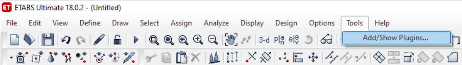
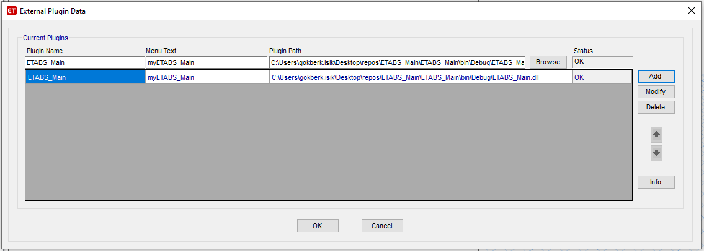
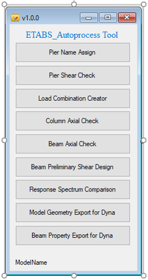

# ETABSPlugins

## Latest Version v1.0.0 

## Invest in Arup Projects
[26240 Useful Plugins for Structural Analysis Softwares](https://invest.arup.com/?layout=projsheet&projid=26240&tab=projsheetdetailstabpage0)

[29152 Useful Plugins for Structural Analysis Softwares Part 2](https://invest.arup.com/?layout=projsheet&projid=29152&tab=projsheetcommentstabpage0)

## License 

Compatible with ETABS 18 and newer versions

## Users - Download release

To use the plugins you can download the latest release from the [releases section](https://gitlab.arup.com/Gokberk.Isik/etabsplugins/-/releases).

## Requirements

In order to use these plugins you will need to add them by using "Add/Show Plugins" option under "Tools" main menu. Status should be "OK".

## Main Interface

## Bug reporting

Please report bug by [opening a new issues](https://gitlab.arup.com/Gokberk.Isik/etabsplugins/-/issues) and use the provided **bug report** templates

## New features

Please submit feature requests by [opening a new issues](https://gitlab.arup.com/Gokberk.Isik/etabsplugins/-/issues) and use the provided **new features** template